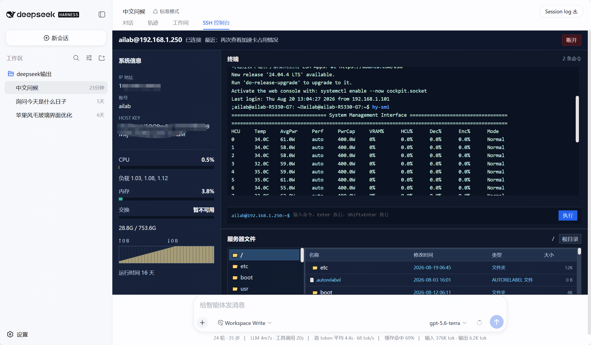
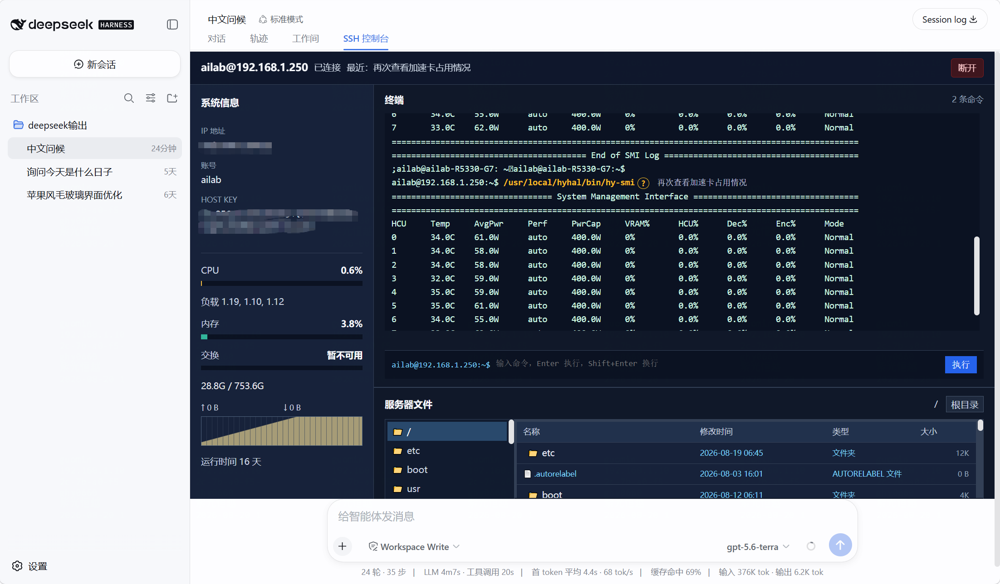
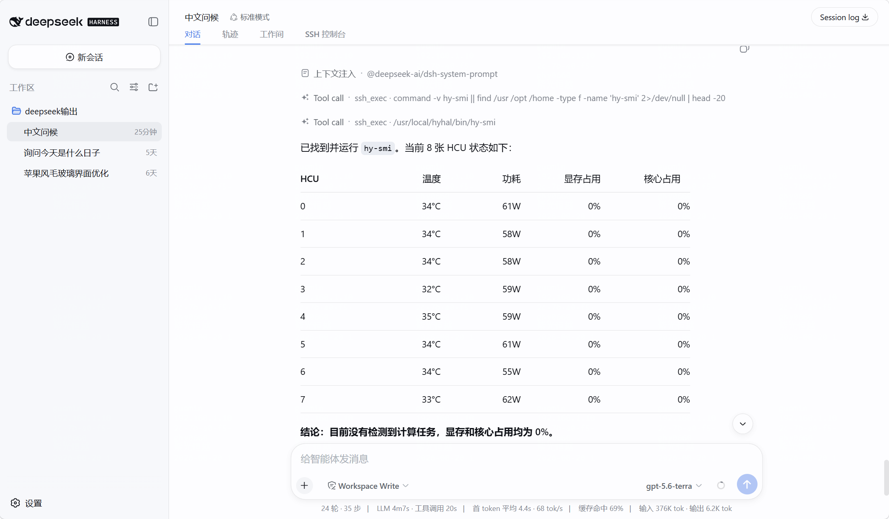

# dsh-withssh

`dsh-withssh` 是 [DeepSeek Harness](https://github.com/deepseek-harness/deepseek-harness) 的会话级 SSH 可视化控制台。它把真实 SSH 终端嵌入当前对话，而不是另开窗口：开发者既能手动操作服务器，也能清楚复盘 AI 执行了什么、为什么执行、服务器返回了什么。



## 这解决什么问题

传统的 AI SSH 工作流只在对话里显示一条工具调用，用户很难观察实际终端回显和执行过程。`dsh-withssh` 保留完整的可见链路：

| 操作者 | 终端中的显示 | 可追溯信息 |
| --- | --- | --- |
| 人工 | 命令文本在原始 prompt 位置高亮为蓝色 | 命令通过当前会话的持久 PTY 执行，输出直接继续写入终端。 |
| AI | 命令文本在原始 prompt 位置高亮为黄色，并带有 `?` | `?` 可展开 AI 必填的中文命令说明；标准输出、错误输出和退出码既显示在终端中，也作为 `ssh_exec` 结果回到 AI 对话。 |

黄色与蓝色只改变命令文本的颜色，不会把命令伪装成卡片或插入到终端输入内容中。用户可以继续在真实终端输入命令，回显可滚动查看。



AI 的 `ssh_exec` 调用和执行结果同样保留在对话记录中，因此可以从对话页确认模型调用了哪条命令、根据返回日志得出了什么结论。



## 界面

- 顶栏显示当前对话的连接状态和最近 AI 操作。一个 Harness 对话至多拥有一个 SSH 连接；切换到其他对话时会先提醒，只有确认后才关闭原连接。
- 左侧显示主机、账号、Host Key 指纹、CPU、负载、内存、交换区、网络计数和运行时间。
- 右上是可滚动的真实终端。人工输入使用持久 PTY；AI 命令和它的返回结果也会写入相同的终端流。
- 右下是从 `/` 开始的只读文件树与目录表格，显示名称、修改时间、类型和大小。
- 未配置 SSH 的对话只显示连接表单，不显示伪造的服务器状态、终端或文件内容。

## 从 GitHub 安装并使用

前提：已经安装可用的 DeepSeek Harness，并能在命令行使用 `dsh`。不需要先克隆本仓库，也不需要在 Harness 源码目录中开发。

以下命令将插件直接加入 Harness 的 `web` 配置档：

```sh
dsh plugin --profile web add github:lhwu1/dsh-withSsh
```

安装过程会使用仓库提交的预构建 `lib/` 文件。首次安装不需要访问 `D:/harness-lh-int8` 或其他本地开发路径。

检查组合是否加载了插件：

```sh
dsh --profile web --dump-config
```

输出中应包含 `dsh-withssh` 和 `dsh-withssh-web`。之后启动 Web 表层：

```sh
dsh --profile web --port 3080
```

在浏览器打开 `http://127.0.0.1:3080/`，进入一个对话，选择 `SSH 控制台` 标签页。

连接步骤：

1. 输入主机、端口、账号和密码，点击“连接服务器”。
2. 插件返回 `sha256:...` 主机密钥指纹后，与服务器管理员或可信记录核对。
3. 指纹确认无误后，再点击“确认并连接”。
4. 在右上终端直接输入人工命令，按 Enter 执行；按 Shift+Enter 换行。
5. 在对话中提出服务器操作需求。当前会话已连接时，AI 会知道 `ssh_exec` 可用，并会在需要时执行带中文说明的命令。

AI 工具调用的预期参数如下：

```json
{
  "command": "/usr/local/hyhal/bin/hy-smi",
  "description": "再次查看加速卡占用情况，确认是否存在正在运行的计算任务"
}
```

`description` 必须包含中文。它不会发送到远端 shell，点击黄色命令后的 `?` 才会在终端中展开显示。

## 更新与卸载

更新 GitHub 安装的插件：

```sh
dsh plugin --profile web update dsh-withssh
```

更新后重启运行中的 Harness，并强制刷新浏览器页面。卸载插件：

```sh
dsh plugin --profile web remove dsh-withssh
```

如果没有看到 `SSH 控制台` 标签，先运行 `dsh --profile web --dump-config` 检查两个插件条目，再重启 Harness。不要同时运行多个指向同一配置档的 Harness 实例。

## 安全行为

- 密码仅短暂经过连接请求、插件进程内存和 `ssh2` 连接配置；连接建立或失败后，插件维护的凭据租约会被清理。密码不写入模型参数、动态上下文、Session 事件、终端历史或持久化文件。
- 首次连接不会自动信任主机密钥，必须由用户确认 SHA-256 指纹。
- AI 命令中的常见高风险模式，例如递归删除、格式化磁盘、关机、重启和危险权限修改，会请求 Harness 审批。人工终端输入仍由操作者负责。
- 远端输出限制为 256 KiB，移除 ANSI/OSC 控制序列，并遮蔽常见 `password`、`secret` 和 `token` 赋值形式；这不是完整的秘密检测系统。
- 文件浏览器只读，不提供文件内容读取、上传、写入或删除操作。

## 限制

- 该插件依赖 Harness Web 表层的同源访问模型，本身没有额外账号认证或 CSRF token。不要把 Web 端口暴露给不受信任的网络；生产环境应使用受保护的本地访问或 TLS 与反向代理认证。
- 文件树可列出 SSH 账号有权限读取的目录名称、大小和修改时间，这些元数据可能敏感。
- `ssh_exec` 的输出会成为 AI 的工具结果。即使终端输出做了常见遮蔽，也应避免执行会打印真实密钥、令牌或密码的命令。
- AI 使用独立 SSH `exec` 通道，人工 PTY 的当前目录和环境变量不会自动同步。AI 长时间命令目前没有单独的取消按钮或执行超时。
- 终端是有限的 PTY 转发和轮询刷新，不等同于完整 xterm.js 仿真。重启 Harness 会清理内存中的 SSH 连接。

## 本地开发

本地开发配置中的 TypeScript 类型路径指向相邻的 Harness 源码检出，因此先把两个仓库放在同一个父目录中：

```text
workspace/
  deepseek-harness-master/
  dsh-withSsh/
```

然后构建：

```sh
git clone https://github.com/lhwu1/dsh-withSsh.git
cd dsh-withSsh
npm install
npm run validate
```

完成构建后，使用本地目录接入 Harness：

```sh
dsh plugin --profile web add D:/path/to/dsh-withSsh
```

本插件只通过 `cordis.patch.yml` 注入自身的 Host 服务、Web 路由和客户端视图，不修改 DeepSeek Harness 主体源码。

## 许可

插件代码使用 [MIT License](LICENSE)。截图中的服务器地址和 Host Key 已做脱敏处理。
